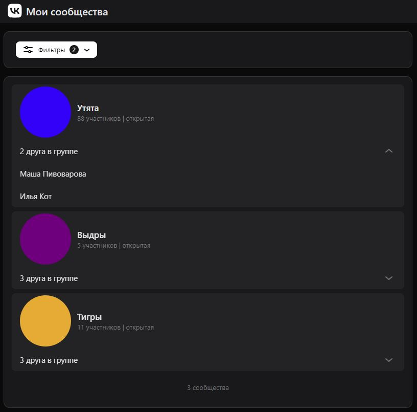

# Fun Communities - Communities finder app solution

In this task, you need to implement a simple React application consisting of a single page, which upon opening will request a list of groups from the backend (mock data should be used). Additionally: а group can be either public or private; а group may have an avatar in the form of a 100px diameter circle filled with the color specified in the avatar_color attribute; a group may contain a list of your friends who are members of it. You should also implement filtering of groups.

## Table of contents

- [Overview](#overview)
  - [The challenge](#the-challenge)
  - [Screenshot](#screenshot)
  - [Links](#links)
- [My process](#my-process)
  - [Built with](#built-with)
  - [Useful resources](#useful-resources)

## Overview

### The challenge

Users should be able to:

- View the list of groups
- See the number of subscribers, the privacy of the group, the avatar, the name, and friends who are in the group
- Have the ability to filter groups by avatar color, presence of friends, and privacy

### Screenshot

### Links

- Solution URL: [github.com/alexbulgakov/fun-communities](https://github.com/alexbulgakov/fun-communities)
- Live Site URL: [fun-communities.vercel.app/](https://fun-communities.vercel.app/)

## My process

### Built with

- [VK UI](https://vkcom.github.io/VKUI/#/About) - This is a library of adaptive React components for building web applications
- [React](https://reactjs.org/) - JS library
- [TypeScript](https://www.typescriptlang.org/)

### Useful resources

- [plural-ru](https://www.npmjs.com/package/plural-ru) - This library helped me to accurately inform the user about how many groups were found. It provides correct declension of nouns and verbs in Russian.
